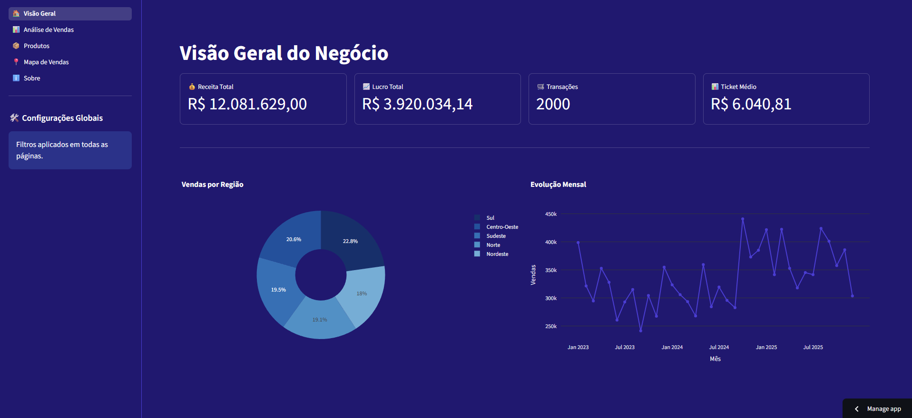
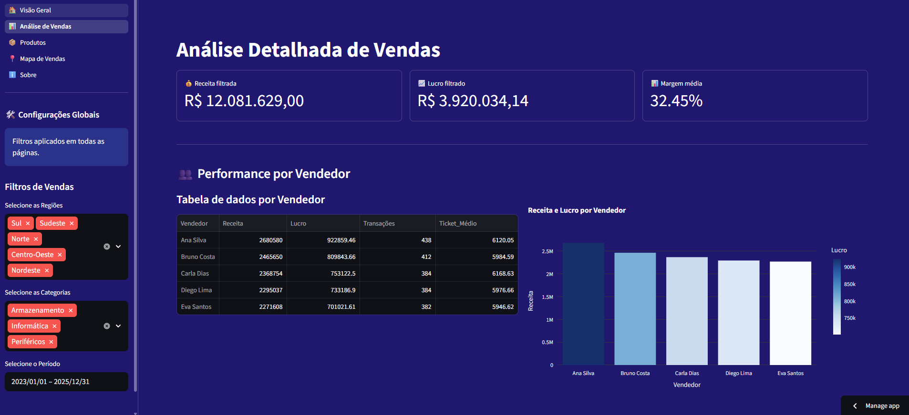
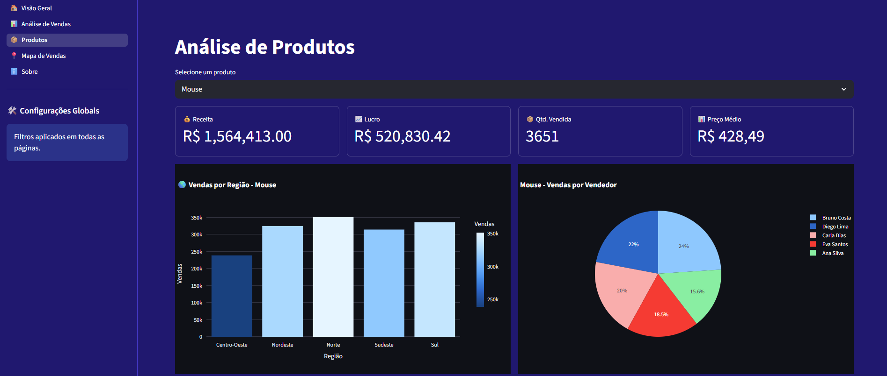
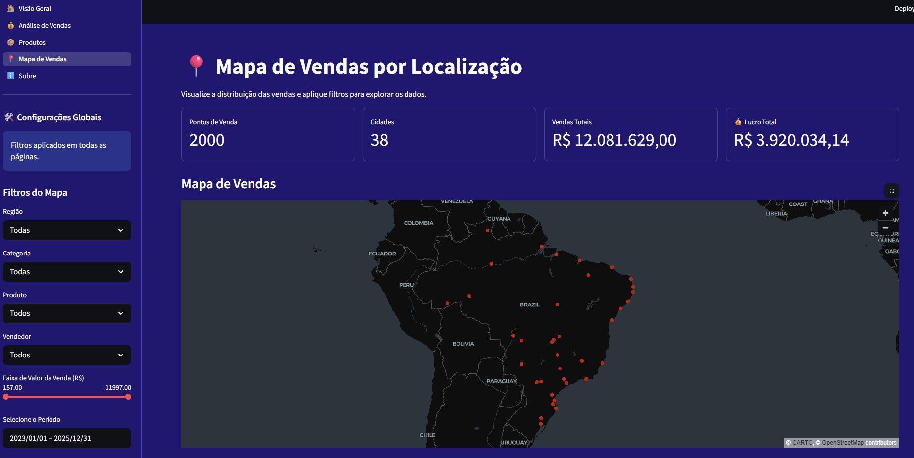

# 🚀 Projeto: Dashboard de Vendas

Um dashboard multi-páginas para análise de vendas (Visão geral, Análises por produto, Mapa de vendas e mais). Criado com Streamlit para exploração interativa dos dados de vendas contidos na pasta `dados/`.

---

## ✨ Visão geral

Este projeto fornece um painel interativo para análise exploratória e visualização geoespacial de vendas. É pensado para ser simples de rodar localmente e estender com novas análises.

Principais funcionalidades:

- 📊 Painel multi-páginas (Visão Geral, Análise de Vendas, Produtos, Mapa, Sobre)
- 🗺️ Visualização geoespacial das vendas por localização
- 📈 Gráficos interativos e métricas-chave
- 🧭 Navegação e filtros globais via sidebar

---

## 🧰 Tecnologias utilizadas

- Python 3.11+ 🐍
- Streamlit (interface interativa) 📋
- Pandas (manipulação de dados) 🧾
- Altair / Plotly / PyDeck (visualizações) 📉
- NumPy (cálculos numéricos) ⚙️

As dependências do projeto estão em `requirements.txt`.

---

## 🖼️ Capturas do Dashboard

Visualizações de exemplo presentes na pasta `img/`.









> Dica: se as imagens não aparecerem no GitHub, verifique se os arquivos estão versionados no repositório.

---

## 📁 Estrutura do projeto

Principais arquivos e pastas:

- `app.py` — arquivo principal que inicia o Streamlit e configura as páginas.
- `pages/` — módulos das páginas do dashboard (ex: `visao_geral.py`, `analise_vendas.py`, `mapa_vendas.py`, `sobre.py`).
- `dados/` — arquivos CSV de exemplo (`vendas.csv`, `vendas_geolocalizacao.csv`, `vendas_geo_resumo.csv`).
- `img/` — capturas e imagens usadas no README e no app.
- `requirements.txt` — dependências Python.

---

## 🚀 Como executar (local)

1. Crie e ative um ambiente virtual (recomendado):

```powershell
python -m venv .venv; .\.venv\Scripts\Activate.ps1
```

2. Instale as dependências:

```powershell
pip install -r requirements.txt
```

3. Inicie o app Streamlit:

```powershell
streamlit run app.py
```

4. O dashboard abrirá automaticamente no navegador (geralmente em `http://localhost:8501`).

---

## 🧩 Dados

Os dados de exemplo ficam em `dados/`. Sinta-se livre para substituir os CSVs por sua base de dados, desde que as colunas esperadas estejam presentes. Se for necessário, atualize os scripts em `pages/` para ajustar às novas colunas.

---

## 🤝 Contribuição

Contribuições são bem-vindas! Exemplos de como colaborar:

- Abrir issues para bugs ou sugestões
- Enviar pull requests com novas análises, correções e melhorias visuais

Quando enviar um PR, por favor inclua uma breve descrição do que foi alterado e, se aplicável, imagens que mostrem as mudanças.

---

## 📬 Contato

Se quiser trocar ideias ou precisar de ajuda para adaptar o dashboard, abra uma issue ou me mande uma mensagem no perfil do repositório.

---

_Feito com ❤️ e Streamlit 📊_
